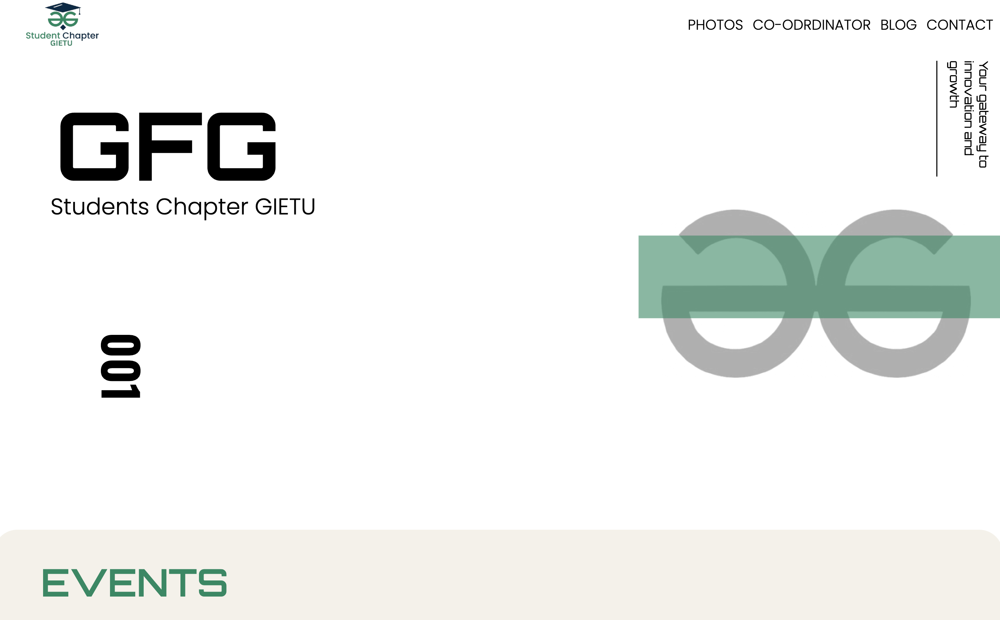

<!-- ================= HEADER ================= -->
<h1 align="center">🌐 GFG Club Website – Frontend Development</h1>

  <a 
    href="https://gfg-website-chi.vercel.app/" 
    target="_blank"
    style="
      display:inline-block;
      padding:10px 20px;
      background:#238636;
      color:#ffffff;
      text-decoration:none;
      border-radius:8px;
      font-weight:600;
      font-size:15px;
    "
  >
    🚀 View Live Website
  </a>

<!-- ================= DESCRIPTION ================= -->

  This repository contains the <b>frontend implementation</b> of a static website developed to support
  a student technical club.  
  The work focuses on <b>frontend development, responsiveness, and deployment</b>, and represents
  a real-world execution of a provided design reference.

<!-- ================= PROJECT OVERVIEW ================= -->
<h2>🚀 Project Overview</h2>
<ul>
  <li>Frontend-only static website</li>
  <li>Built using HTML, CSS, and JavaScript</li>
  <li>Responsive across mobile and desktop devices</li>
  <li>Publicly deployed for demonstration</li>
</ul>

<!-- ================= CONTRIBUTION ================= -->
<h2>💪 My Contribution</h2>
<ul>
  <li>Implemented the complete frontend from scratch</li>
  <li>Converted provided design references into functional UI</li>
  <li>Built responsive layouts</li>
  <li>Maintained clean and readable HTML/CSS structure</li>
  <li>Handled deployment and hosting</li>
</ul>

<!-- ================= TECH STACK ================= -->
<h2>🛠️ Tech Stack</h2>
<ul>
  <li>HTML5</li>
  <li>CSS3</li>
  <li>JavaScript</li>
  <li>Responsive Web Design</li>
  <li>Vercel (Deployment)</li>
</ul>

<!-- ================= PROJECT STRUCTURE ================= -->
<h2>📂 Project Structure</h2>

<pre style="
  background:#0d1117;
  color:#c9d1d9;
  padding:16px;
  border-radius:10px;
  overflow-x:auto;
  font-size:14px;
">
GFG-Website/
│── screenshots/
│   └── screenshot.png
│── index.html
│── style.css
│── README.md
</pre>

<!-- ================= SCREENSHOT ================= -->

  

  <a href="https://gfg-website-chi.vercel.app/" target="_blank">
    🔗 Open Live Website
  </a>

<!-- ================= DISCLAIMER ================= -->
<h2>📜 Note</h2>

  This project is maintained as a <b>portfolio and learning artifact</b>.
  No claim is made over original design ownership.

<!-- ================= AUTHOR ================= -->
<h2>👨‍💻 Developer</h2>

  <b>Sai Subham</b> 
  BTech CSE | Frontend & Android Developer

